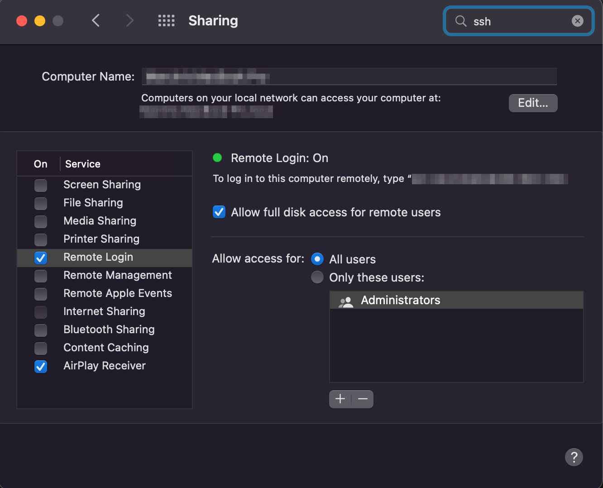

# macbook-devops

Ansible repository for creating DevOps MacBook, based on [https://github.com/marcinbojko/linux_mint](https://github.com/marcinbojko/linux_mint)

## Usage

### Architecture

Playbook introduces separation of amd64 and arm64 architectures based on ansible facts. Due to fact I do not have M1 chip based Mac, it's possible to have some applications existing in only one architecture type.
In time, I'll separate them by having dirrerent test. If you have an information about these specific packages belinging to only one of architectures, please let me know

### Enable `ssh` aka `remote access`



### Group vars

```yaml
ansible_user: your_user
ansible_port: 22
ansible_connection: ssh
```

### Install xcode and accept license

```bash
sudo xcode-select --install
sudo xcodebuild -license accept
```

[https://apps.apple.com/us/app/xcode/id497799835?mt=12](https://apps.apple.com/us/app/xcode/id497799835?mt=12)

or get it from AppStore

### Run playbook (remotely)

```bash
ansible-playbook ./macbook-devops.yaml -i ../macbook.lst -e '{"sudo_password": "your_user_password"}'
```

### Run playbook locally - extra steps

#### Install Homembrew

```bash
/bin/bash -c "$(curl -fsSL https://raw.githubusercontent.com/Homebrew/install/HEAD/install.sh)"
```

#### Install ansible

```bash
brew install ansible
```

### Variables

#### main playbook

|Variable|Descripton|Default|
|--------|----------|-------|
|delay_time|how many seconds wait between attempts|3|
|install_appstore|Install Appstore Apps|true|
|install_aws_tools|Install aws-cli|true|
|install_azure_tools|Install azure-cli|true|
|install_extra_tools|Install extra (unpack section) tools|true|
|install_gcloud_tools|Install google-cloud-sdk|true|
|install_npm|Install npm packages|true|
|install_oci_tools|Install oci-cli|true|
|install_osx_defaults|Change default OSX settings through `osx_defaults` module|true|
|install_rosetta|Install Rosetta 2 package|true|
|retries_count|how many times retry tasks|2|
|update_homebrew_packages|Should we upgrade formulae and casks|true|
|update_homebrew|Should we install homebrew by itself|true|

#### tasks

|Variable|Descripton|Default|
|--------|----------|-------|
|bin_path|where to store executable files| /usr/local/bin|
|unpack_folder|where to store downloaded archives| /tmp/macbook|

## Content

### Formulae

### Casks

### Tasks

#### `download_files`

Download, unpack and copy executable files from `unpack` section of variables to a folder `bin_path`

example of downloading kubestr file and putting it into `bin_path`

```yaml
unpack:
- url: https://github.com/kastenhq/kubestr/releases/download/v0.4.31/kubestr_0.4.31_MacOS_amd64.tar.gz
  url_arm64: https://github.com/kastenhq/kubestr/releases/download/v0.4.31/kubestr_0.4.31_MacOS_arm64.tar.gz
  destination: kubestr
  source: kubestr
  destination_file: kubestr.tar.gz
  folder:
```

### AppStore Apps

|Name|Description|URL|
|----|-----------|---|
|CopyClip|Clipboard Manager|[https://apps.apple.com/us/app/copyclip-clipboard-history/id595191960?mt=12](https://apps.apple.com/us/app/copyclip-clipboard-history/id595191960?mt=12)|
|Microsoft Remote Desktop|RDP|[https://apps.apple.com/pl/app/microsoft-remote-desktop/id1295203466?l=pl&mt=12](https://apps.apple.com/pl/app/microsoft-remote-desktop/id1295203466?l=pl&mt=12)|
|The Unarchiver|Open any archive in seconds|[https://theunarchiver.com/](https://theunarchiver.com/)|

### Change OSX defaults

Using `osx_defaults` module you can set any OSX settings. Remember to relogin afterwards

|Name|Key|Value|Type|Description|
|----|---|-----|----|-----------|
|com.apple.backupd-auto.plist|StartInterval|14400|int|Frequency of a TimeMachine backups in seconds|

## ToDO

* ~~add more tools~~
* ~~add system settings~~
* add upgrade packages options
* add custom files allowing you to add or exlude specific packages without modyfing playbook files directly
* ~~add npm~~
* ~~add external packages not available through homebrew or AppStore~~
* ~~add M1 chip files~~

## Known issues

Q: Installation of homebrew casks hangs
A: `sudo_password` variable is not set or set to improper value

Q: Some applications are failing install on M1 chip (for example: `virtualbox`)
A: Some applications are still not available for ARM64 architecture, even with Rosetta 2

Q: Ansible hangs on `run_initial_setup_instead_of_gather_facts` step.
A: Check if you'd accepted xcode license. Check and delete `.ansible` folder in your users home directory. Restart Macbook. Blame Apple.

## Participate

If you feel there is another package/setting/feature worth mentioning - please contact me. If you'd like to add PR - please add as smallest portions as possible (for example: package after package or feature after feature )
